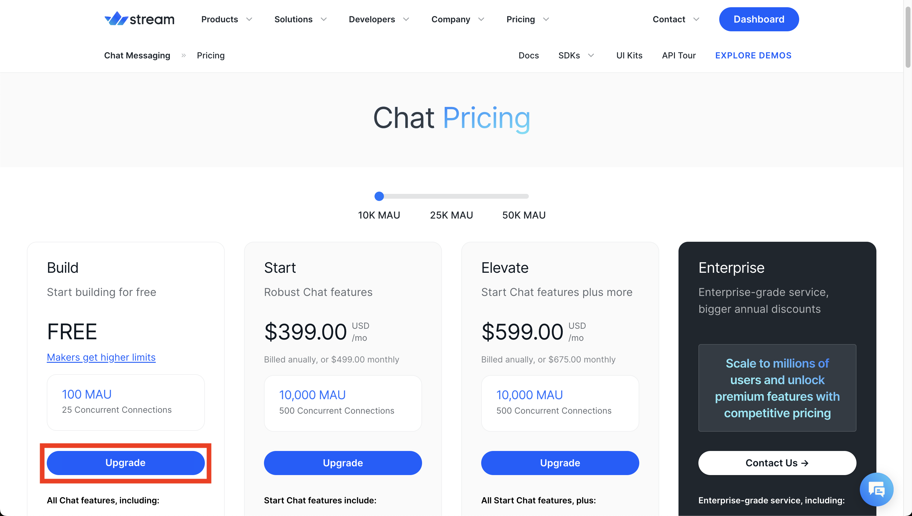
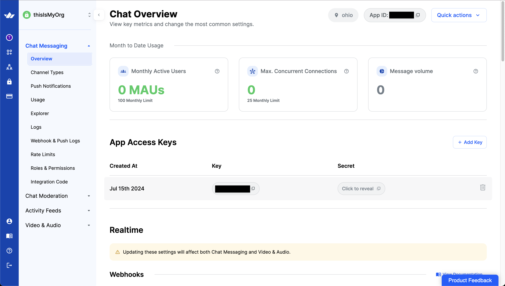
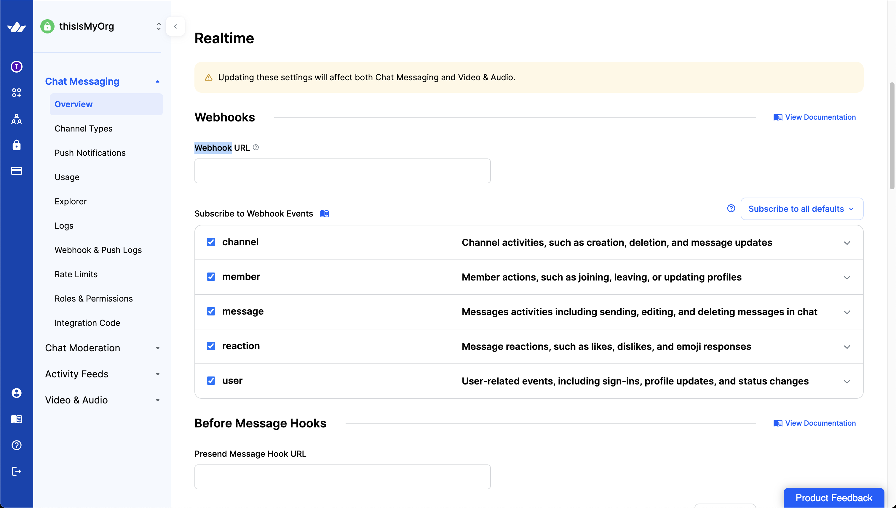

# What is this?

An AI-powered tool that converts natural language into functional NodeJS or Python code. The code runs in the cloud for instant testing and can be saved for later use.

# Who is this for?

Individuals who possesses no technical background but with AI prompting interest and IT workers.

# Our Hosted Demo

> An Anthropic API key is required to use the demo. You can create an Anthropic account [here](https://console.anthropic.com/) and top up 5 USD. Then, [generate an API key](https://docs.anthropic.com/en/docs/quickstart#set-your-api-key).

[https://carpenter.firstbot.tech/](https://carpenter.firstbot.tech/)

# Requirement

- Git
- NodeJS 18.x
- Python 3.11.x
- npm package
  - `@aws-amplify/cli@12.12.2`
  - `yarn@1.22.22`
- pypi package `pipenv==2024.0.1` (For building Python AWS Lambda)

- Vercel (Frontend)
- AWS Amplify (Backend)
- Streamio (Chat API service)

- Anthropic API Key

# Development and Tinkering

1. `git clone https://github.com/kiostudio/firstbot-carpenter`
2. `cd <path_to_firstbot-carpenter>`
3. `yarn install`
4. `amplify configure` or follow 
5. `amplify init` to initialize the amplify project on AWS.
6. `amplify push` to create the resources and input empty strings if amplify cli asks for any function environment variables.
7. After amplify push completed, go to .  of `firstbotPythonRuntime-<YOUR_AMPLIFY_ENVIRON_NAME>`, `firstbotNodeJsRuntime-<YOUR_AMPLIFY_ENVIRON_NAME>`, `firstbotStreamioAction-<YOUR_AMPLIFY_ENVIRON_NAME>`, `firstbotStreamioWebhook-<YOUR_AMPLIFY_ENVIRON_NAME>`.
8. Create stream io trial account . Then, create a sample organisation. Go to  and click Upgrade button under build tier to unlock trial usage.

   

9. Go to your organisation. Click the sample app. Expand Chat Messaging and click Overview. The streamio app access key and secret are automatically created for you.

   

10. Scroll down the same page. Update the webhook URL endpoint to the URL of `firstbotStreamioWebhook-<YOUR_AMPLIFY_ENVIRON_NAME>` on streamio interface.

    

11. `amplify update function` to update the function environment variable of `firstbotAnthropicRuntime` and input the function URLs of `firstbotPythonRuntime-<YOUR_AMPLIFY_ENVIRON_NAME>` and `firstbotNodeJsRuntime-<YOUR_AMPLIFY_ENVIRON_NAME>` you created in step 8. For details, you can follow .
12. Repeat the same procedure for function `firstbotTriggerRuntime`.
13. `amplify update function` to update the function environment variable of `firstbotStreamioAction` and input the streamio API key.
14. `amplify push` to commit environment variables update.
15. Also, `amplify update function` to update the secret value of `firstbotStreamioAction` to input the streamio secret key obtained on step 9. For details configuring the function secret values, you can follow .
16. `yarn dev`
17. Open http://localhost:3000 with your browser to see the result.
18. Fire up the code editor and happy hacking!

## Production Deployment

- Setup a new AWS Amplify environment for production.
- Setup another Git branch to store production code.
- Setup a Vercel account and allow building and publishing after repository of GitHub or other git hosting is connected.
- Setup another streamio app for production.

# Provided by Firstbot

This is created by Kios Tech Inc. as a teaser for its AI platform Firstbot. You are welcomed to try it .
